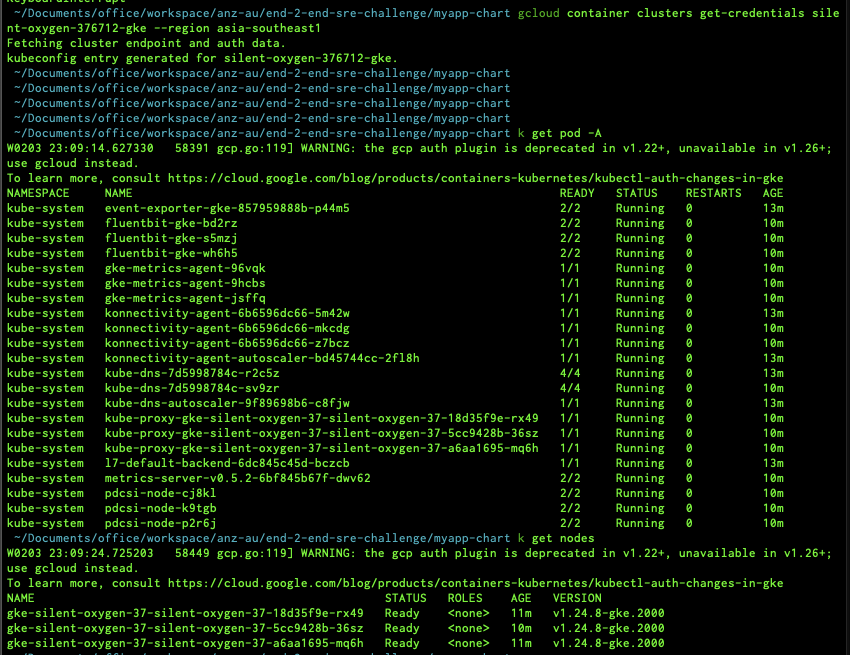
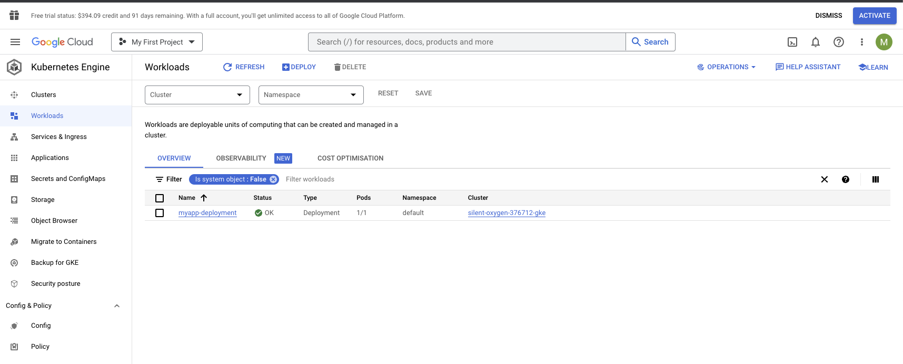
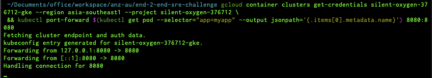
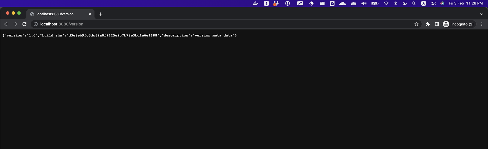
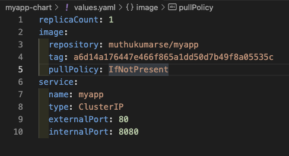
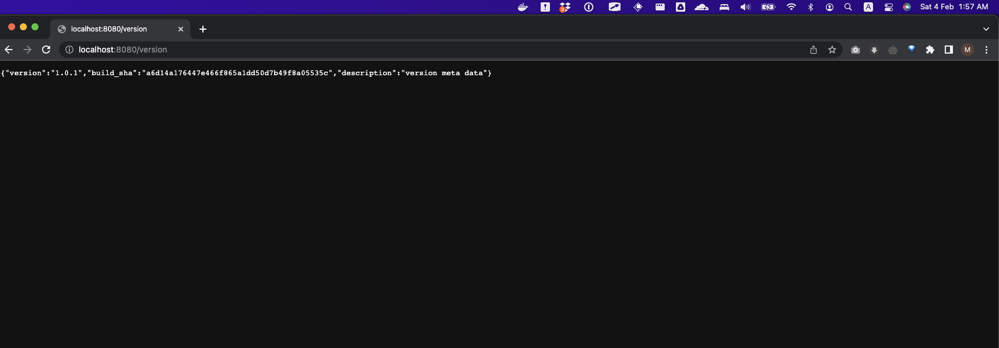
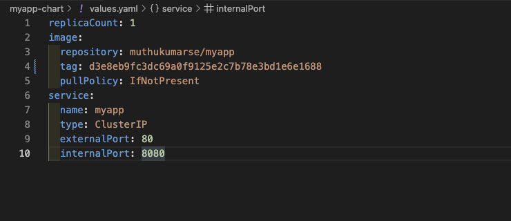
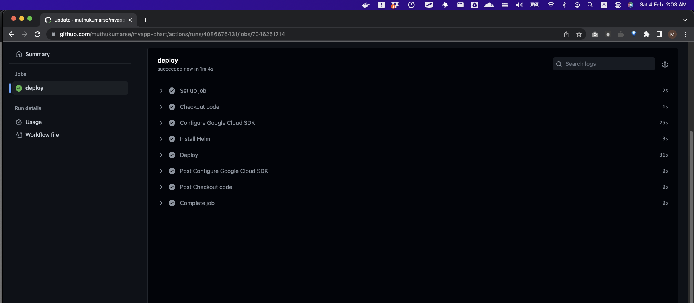
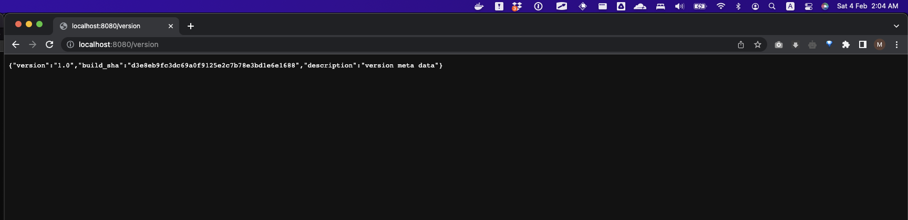

## Connect GKE to deploy helm chart manually
- Assume that, you have kubectl CLI installed
- get the kubeconfig standard way
  - `gcloud container clusters get-credentials silent-oxygen-376712-gke --region asia-southeast1`
- Check you able to run below command to check the nodes created above
  - `kubectl get nodes`
  - `kubectl get pods -A`
  

- Deploy Helm chart manaully to Test


- Check the Deployment over Google Console


- Do port-forward to check the Service
  ```
  gcloud container clusters get-credentials silent-oxygen-376712-gke --region asia-southeast1 --project silent-oxygen-376712 \
  && kubectl port-forward $(kubectl get pod --selector="app=myapp" --output jsonpath='{.items[0].metadata.name}') 8080:8080
  ```
  

- Browse in local


- Updated `tag` in [values.yaml](./values.yaml) to Test the change.

- added standard busybox test for helm chart

## Over CD (Github Action)
- Helm is quick way to deploy and manage the deployment artifact easier, but there other alternate as well.
- Since github action and GKE moved forward alot, so need to do some workaround on Runner
- build new image over CI through `myapp` project
- Updated `tag` in [values.yaml](./values.yaml) to Test the change.
- Push the changes
- CD will run automatically and deploy the latest changed image
- First run
  

  
- Second run after update
  

  

  
